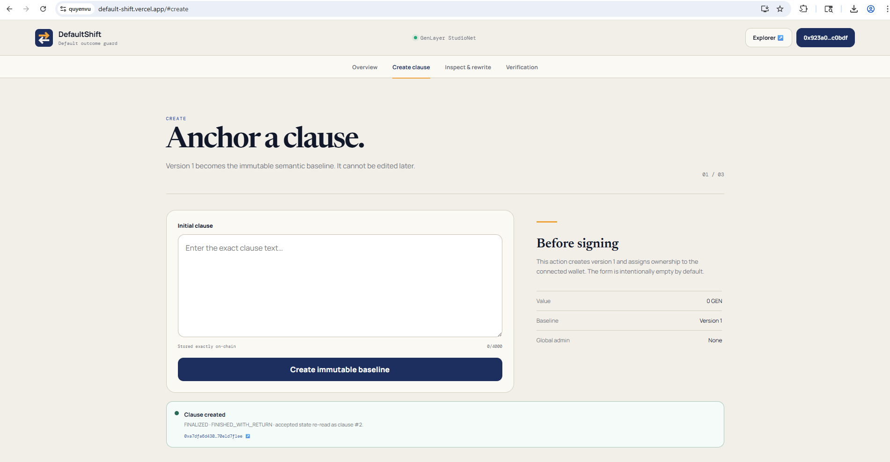
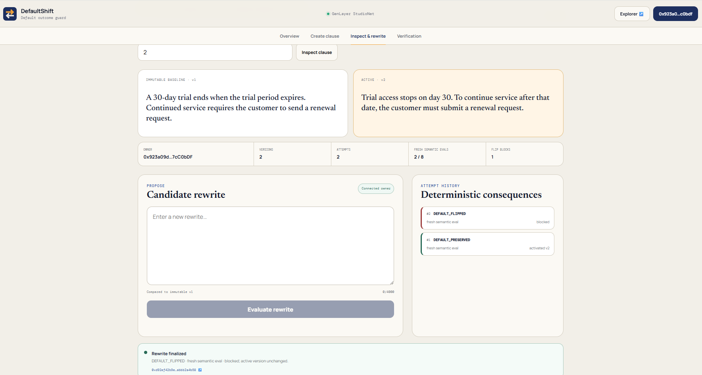
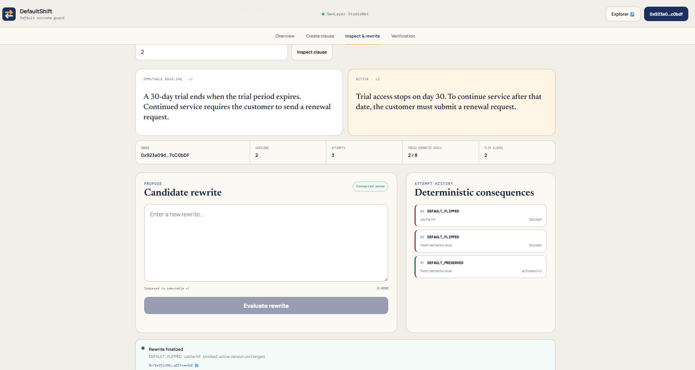
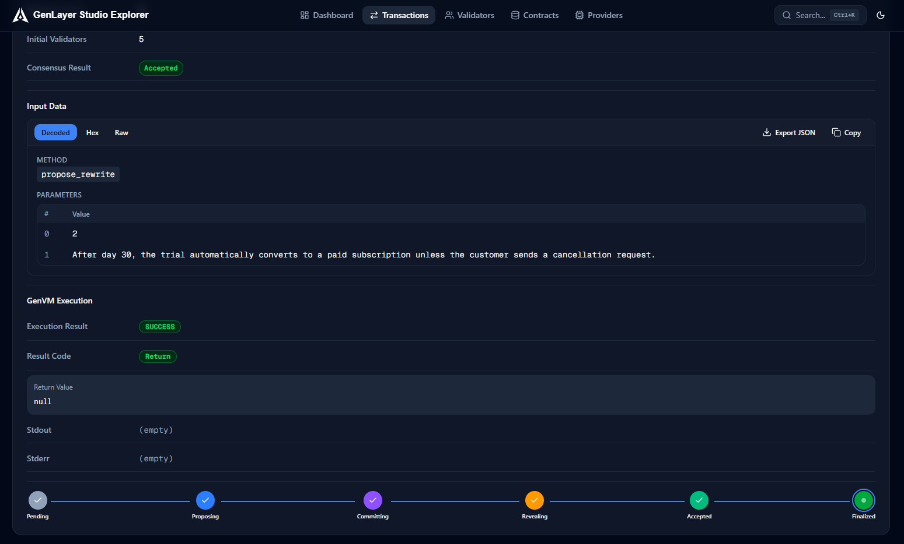

# DefaultShift testing

## Frozen contract source

SHA256:

`1f5207a086131aeb81e1e6f7044e338949e4ba49e42fea04ed8d610d64d58e09`

Project address:

`0xD324ADB41211F1eB2e4889d04cD20BaA5b9c3b3E`

Website:

`https://default-shift.vercel.app`

## Build and integration gates

Run:

```bash
npm run verify:source
npm run check
npm test
npm run build
```

`npm run check`, `npm test` and `npm run verify:source` verify exact contract
source parity and frontend/contract integration invariants. They are **static**:
they hash the contract and match strings in the source. They do not execute the
contract, and nothing in this section should be read as behavioural proof.

## Contract behaviour, executed on real GenVM

```bash
pip install "genlayer-test==0.29.2" "pytest>=8,<9"
python -m pytest tests/direct/ -q
```

```text
15 passed
```

`genlayer-test` Direct Mode runs `contracts/DefaultPolarityGuard.py` inside a
real GenVM build. Nothing is stubbed and no contract logic is re-implemented, so
the suite cannot drift from the deployed source. `tests/direct/conftest.py` pins
the GenVM version, so a clean machine executes the same runtime instead of
resolving "latest".

`test_clause_lifecycle.py` executes the same sequence recorded under
**Executed StudioNet Project runtime** below — creation, a fresh
`DEFAULT_PRESERVED` activation, a fresh `DEFAULT_FLIPPED` block, and exact cached
reuse — and asserts the same counters the live run produced. It also proves the
two properties the design rests on: every candidate is compared to the immutable
version-1 baseline even after the active version has moved on, and a verdict
cached for one clause is never reused for another clause that happens to share
the same baseline text.

`test_guards.py` covers what the contract refuses. Six malformed consensus
outputs — unknown verdict, extra key, wrong type, wrong key, non-JSON, non-object
— each revert with no attempt written, no budget spent and no version added. A
rewrite byte-identical to the active text is refused, including one that differs
only by surrounding whitespace. The eight-evaluation budget is exercised to
exhaustion: a ninth fresh candidate is refused and writes nothing, while a
previously cached candidate still resolves, so the clause is bounded rather than
frozen. Restoration to the version-1 baseline resolves from the seeded cache and
spends no budget. Finally, clause text carrying a forged fence tag and an
embedded verdict token cannot reach the model as instructions, and the stored
text is kept exact.

The model answer in these tests comes from `mock_llm`; the suite never invents a
consensus outcome, it states one and checks what the contract does with it.

## Post-fix StudioNet run — clause #2

Executed on 2026-09-10 through the deployed frontend, after the wallet-connection
fix described in the README. Owner wallet `0x923a09d…7cC0bDF`. Contract and
address unchanged.

This run exists because a reviewer reported `Create clause failed / method
[wallet_getSnaps] doesn't has corresponding handler`. Every write in the app went
through the same code path, so the failure was not specific to clause creation.
Both write methods are exercised below.

### 1. `create_clause` — the action that was reported failing



```text
Clause created
FINALIZED · FINISHED_WITH_RETURN · accepted state re-read as clause #2
0xa7dfa6d4308f9ed5801285ad3ee92fe9af45b189ce79b9e6f1aad070e1d7f1ee
```

The wallet was asked only to switch network and sign. No Snap install prompt
appears, because `wallet_getSnaps` is no longer called at all.

### 2. `propose_rewrite` — `DEFAULT_PRESERVED`, appended and activated

Rewrite: *"Trial access stops on day 30. To continue service after that date, the
customer must submit a renewal request."*


```text
Rewrite finalized
DEFAULT_PRESERVED · fresh semantic eval · activated version 2
0x25416672c0a790e4008ce9de8e485837a1ed881c2343da6346263e5d85daf1cb
```

| | |
|---|---|
| Verdict | `DEFAULT_PRESERVED`, fresh semantic eval |
| Consequence | activated version 2 |
| Versions / Attempts | 2 / 1 |
| Fresh semantic evals | **1 / 8** |
| Flip blocks | 0 |

The second write method works too, which is what confirms the fix was not
partial.

### 3. `propose_rewrite` — `DEFAULT_FLIPPED`, blocked

Rewrite: *"After day 30, the trial automatically converts to a paid subscription
unless the customer sends a cancellation request."*



```text
Rewrite finalized
DEFAULT_FLIPPED · fresh semantic eval · blocked; active version unchanged
0xd92ef42b9ec7838f116f4d9fc8ff1cd37d076e685b0ad401a67511abbb2a4b58
```

| | |
|---|---|
| Versions | **2 — unchanged** |
| Active | **v2 — unchanged** |
| Attempts | 2 |
| Fresh semantic evals | 2 / 8 |
| Flip blocks | **1** |

Both rewrites describe the same 30-day trial and both are plausible contract
prose. The only difference is what happens when nobody acts: under the baseline
and under rewrite 2, service stops; under rewrite 3, it silently becomes paid.
That single reversal is the whole question this contract asks, and it is the
difference between an activated version and a blocked one.

### 4. `propose_rewrite` — exact resubmission, cache hit

The rewrite from step 3, submitted again unchanged.



```text
Rewrite finalized
DEFAULT_FLIPPED · cache hit · blocked; active version unchanged
0x7de3f1c56cc3bd264cceb3f58212b213782b716c693fc396d7ab41a627cee4b8
```

| | |
|---|---|
| Attempts | 3 |
| Flip blocks | 2 |
| Fresh semantic evals | **still 2 / 8** |

Attempts and blocks both advance; the semantic budget does not. Resubmitting an
already-classified candidate buys no second consensus round, so paraphrase-free
repetition costs the proposer an attempt and costs the network nothing.

### 5. Explorer — execution evidence, not just finalization



```text
Method            propose_rewrite
Parameters        2 · "After day 30, the trial automatically converts to a paid
                     subscription unless the customer sends a cancellation request."
Consensus Result  Accepted
Execution Result  SUCCESS
Result Code       Return
Lifecycle         Pending → Proposing → Committing → Revealing → Accepted → Finalized
```

The frontend does not treat `FINALIZED` as success on its own: it reads the
execution result and then re-reads accepted contract state before presenting the
outcome, which is why step 4's panel and this page agree.

## Earlier StudioNet run — clause #1

Recorded before the wallet-connection fix. The contract was not changed, so these
results remain valid; they are kept as the original record.

The identifiers in this section were noted in truncated form at the time and are
left as recorded rather than reconstructed. The post-fix run above carries full
transaction hashes for every write; use that section to verify on the explorer.

All cases below were executed through the deployed DefaultShift frontend against the Project address above. Application-level success was accepted only after transaction finalization, GenVM execution evidence, and matching accepted-state reads.

### Case P1 — clause creation

Baseline:

`A 30-day trial ends when the trial period expires. Continued service requires the customer to send a renewal request.`

Post-state for Clause #1:

- active version: 1
- versions: 1
- attempts: 0
- fresh semantic evals: 0/8
- flip blocks: 0

### Case P2 — fresh DEFAULT_PRESERVED

Rewrite:

`Trial access stops on day 30. To continue service after that date, the customer must submit a renewal request.`

Observed attempt #1:

- verdict: `DEFAULT_PRESERVED`
- fresh semantic eval
- activated version 2
- versions: 2
- attempts: 1
- fresh semantic evals: 1/8
- flip blocks: 0
- Explorer identifier: `0x01cc8235…16e152ef`

### Case P3 — fresh DEFAULT_FLIPPED

Rewrite:

`After day 30, the trial automatically converts to a paid subscription unless the customer sends a cancellation request.`

Observed attempt #2:

- verdict: `DEFAULT_FLIPPED`
- fresh semantic eval
- blocked
- active version remained 2
- versions remained 2
- attempts: 2
- fresh semantic evals: 2/8
- flip blocks: 1
- Explorer identifier: `0xa8476d5a…204dc5e1`

### Case P4 — exact cached verdict reuse

The exact P3 rewrite was submitted again.

Observed attempt #3:

- verdict: `DEFAULT_FLIPPED`
- cache hit
- blocked
- active version remained 2
- versions remained 2
- attempts: 3
- fresh semantic evals stayed 2/8
- flip blocks: 2
- Explorer identifier: `0x5b84b44a…9f05619d`

This proves exact cached-verdict reuse does not consume another fresh semantic evaluation.

## Explorer checkpoint

The StudioNet contract page showed the Project deployment plus clause creation and all three `propose_rewrite` writes. Every listed write was `FINALIZED`, GenVM result `SUCCESS`, consensus result `Accepted`. The frontend separately displayed the recorded verdict/history and re-read state, so the runtime claim does not equate `FINALIZED` with successful execution.

## Final state after representative Project flow

Clause #1:

- immutable baseline: v1 original text
- active: v2 preserved rewrite
- versions: 2
- attempts: 3
- fresh semantic evals: 2/8
- flip blocks: 2

No native GEN transfer is part of this primitive; the tested writes used the contract's semantic classification and deterministic on-chain version/block consequences.
